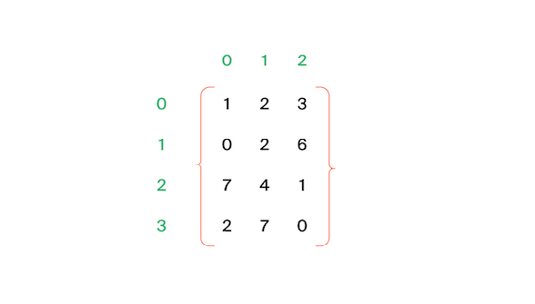
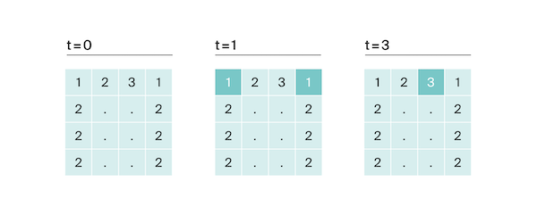
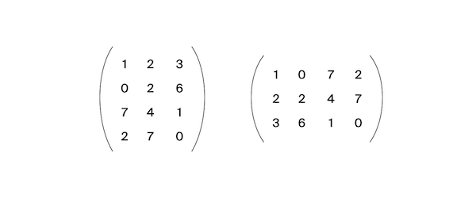
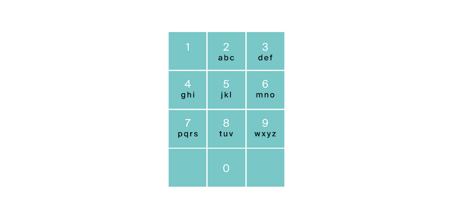
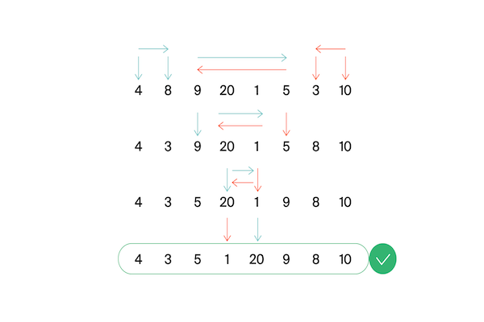

<style>
  summary {
    font: 16px "Open Sans", Calibri, sans-serif;
  }
  img {
      display: block;
      margin-left: auto;
      margin-right: auto;
      width: 60%;
  }
</style>

# Решение задач по алгоритмам на языке Python в Яндекс.Контекст
## [Пробные задачи по алгоритмам](https://contest.yandex.ru/contest/26365/problems/)

---

<details>
  <summary>
    <b>
      A. A+B (<a href="sprint_0/sum.py">sum.py</a>)
    </b>
  </summary>

В задаче вам придётся прочитать два числа и сложить их. Результат необходимо
вывести на стандартный поток вывода или в файл, указанный в условии задачи.

### Формат ввода
В первой строке задано первое число, во второй – второе. Оба числа лежат в
диапазоне от −10<sup>9</sup> до 10<sup>9</sup>.

### Формат вывода
Выведите единственное число – результат сложения двух чисел.

### Пример 1
| Ввод      | Вывод |
|:----------|:------|
| 12<br/>90 | 102   |

### Пример 2
| Ввод         | Вывод |
|:-------------|:------|
| 200<br/>-200 | 0     |

### Пример 3
| Ввод                      |   Вывод    |
|---------------------------|:----------:|
| 1000000000<br/>1000000000 | 2000000000 |
</details>

---
<details>
  <summary>
    <b>
      B. Застёжка-молния (<a href="sprint_0/zipper.py">zipper.py</a>)
    </b>
  </summary>

Даны два массива чисел длины *n*. Составьте из них один массив длины *2n*, в
котором числа из входных массивов чередуются (первый - второй - первый -
второй - ...). При этом относительный порядок следования чисел из одного
массива должен быть сохранён.

### Формат ввода
В первой строке записано целое число *n* – длина каждого из массивов,
*1 ≤ n ≤ 1000*. Во второй строке записано n чисел из первого массива, через
пробел. В третьей строке – *n* чисел из второго массива. Значения всех чисел -
натуральные и не превосходят *1000*.

### Формат вывода
Выведите *2n* чисел из объединённого массива через пробел.

### Пример 1
| Ввод                  | Вывод       |
|:----------------------|:------------|
| 3<br/>1 2 3<br/>4 5 6 | 1 4 2 5 3 6 |

### Пример 2
| Ввод          | Вывод |
|:--------------|:------|
| 1<br/>1<br/>2 | 1 2   |

### Пример 3
| Ввод                  | Вывод       |
|:----------------------|:------------|
| 3<br/>1 8 9<br/>2 3 1 | 1 2 8 3 9 1 |
</details>

---
<details>
  <summary>
    <b>
      C. Скользящее среднее
      (<a href="sprint_0/moving_average.py">moving_average.py</a>)
    </b>
  </summary>

Вам дана статистика по числу запросов в секунду к вашему любимому
рекомендательному сервису. Измерения велись *n* секунд. В секунду *i* поступает
*q<sub>i</sub>* запросов. Примените метод скользящего среднего с длиной окна *k* к этим
данным и выведите результат.

### Формат ввода
В первой строке передаётся натуральное число *n*, количество секунд, в течение
которых велись измерения. *1 ≤ n ≤ 10<sup>5</sup>*. Во второй строке через
пробел записаны *n* целых неотрицательных чисел *q<sub>i</sub>**, каждое лежит
в диапазоне от *0* до *10<sup>3</sup>*. В третьей строке записано натуральное
число *k (1 ≤ k ≤ n)* - окно сглаживания.

### Формат вывода
Выведите через пробел результат применения метода скользящего среднего к серии
измерений. Должно быть выведено *n - k + 1* элементов, каждый элемент -
вещественное (дробное) число.

### Пример 1
| Ввод                      | Вывод           |
|:--------------------------|:----------------|
| 7<br/>1 2 3 4 5 6 7<br/>4 | 2.5 3.5 4.5 5.5 |

### Пример 2
| Ввод                          | Вывод                                                |
|:------------------------------|:-----------------------------------------------------|
| 9<br/>9 3 2 0 1 5 1 0 0<br/>3 | 4.6666666667 1.666666667 1 2 2.333333335 2 0.3333333 |

### Пример 3
| Ввод                  | Вывод |
|:----------------------|:------|
| 5<br/>1 2 3 4 5<br/>5 | 3     |
</details>

---
<details>
  <summary>
    <b>
      D. Две фишки (<a href="sprint_0/two_sum.py">two_sum.py</a>)
    </b>
  </summary>

Рита и Гоша играют в игру. У Риты есть *n* фишек, на каждой из которых написано
количество очков. Сначала Гоша называет число *k*, затем Рита должна выбрать
две фишки, сумма очков на которых равна заданному числу. Рите надоело искать
фишки самой, и она решила применить свои навыки программирования для решения
этой задачи. Помогите ей написать программу для поиска нужных фишек.

### Формат ввода
В первой строке записано количество фишек *n*, *2 ≤ n ≤ 10<sup>4<sup>*.
Во второй строке записано *n* целых чисел - очки на фишках Риты в диапазоне от
*-10<sup>5</sup>* до *10<sup>5</sup>*.
В третьей строке - загаданное Гошей целое число *k*,
*-10<sup>5</sup>* ≤ k ≤ *10<sup>5</sup>*.

### Формат вывода
Нужно вывести два числа - очки на двух фишках, в сумме дающие *k*.
Если таких пар несколько, то можно вывести любую из них.
Если таких пар не существует, то вывести «None».

### Пример 1
| Ввод                         | Вывод |
|:-----------------------------|:------|
| 6<br/>-1 -1 -9 -7 3 -6<br/>2 | -1 3  |

### Пример 2
| Ввод                            | Вывод |
|:--------------------------------|:------|
| 8<br/>6 2 8 -3 1 1 6 10<br/>100 | None  |
</details>

---
<details>
  <summary>
    <b>
      E. Две фишки - 2 (<a href="sprint_0/two_sum_2.py">two_sum_2.py</a>)
    </b>
  </summary>

Рита и Гоша играют в игру. У Риты есть *n* фишек, на каждой из которых написано
количество очков. Фишки лежат на столе в порядке неубывания очков на них.
Сначала Гоша называет число *k*, затем Рита должна выбрать две фишки, сумма
очков на которых равна заданному числу.

Рите надоело искать фишки самой, и она решила применить свои навыки
программирования для решения этой задачи. Помогите ей написать программу для
поиска нужных фишек. 

### Формат ввода
В первой строке записано количество фишек *n*, *2 ≤ n ≤ 10<sup>5<sup>*.
Во второй строке записано *n* целых чисел - очки на фишках Риты в диапазоне от
*-10<sup>5</sup>* до *10<sup>5</sup>*.
В третьей строке - загаданное Гошей целое число *k*,
*-10<sup>5</sup>* ≤ k ≤ *10<sup>5</sup>*.

### Формат вывода
Нужно вывести два числа - очки на двух фишках, в сумме дающие *k*.
Если таких пар несколько, то можно вывести любую из них.
Если таких пар не существует, то вывести «None».

### Пример 1
| Ввод                         | Вывод |
|:-----------------------------|:------|
| 6<br/>-9 -7 -6 -1 -1 3<br/>2 | -1 3  |

### Пример 2
| Ввод                            | Вывод |
|:--------------------------------|:------|
| 8<br/>-3 1 1 2 6 6 8 10<br/>100 | None  |
</details>

---
## [Введение в алгоритмы](https://contest.yandex.ru/contest/23389/problems/)

---
<details>
  <summary>
    <b>
      A. Значения функции
      (<a href="sprint_1/evaluate_function.py">evaluate_function.py</a>)
    </b>
  </summary>

Вася делает тест по математике: вычисляет значение функций в различных точках.
Стоит отличная погода, и друзья зовут Васю гулять. Но мальчик решил сначала
закончить тест и только после этого идти к друзьям. К сожалению, Вася пока не
умеет программировать. Зато вы умеете. Помогите Васе написать код функции,
вычисляющей *y = ax2 + bx + c*. Напишите программу, которая будет по
коэффициентам *a, b, c* и числу *x* выводить значение функции в точке *x*.

### Формат ввода
На вход через пробел подаются целые числа *a, x, b, c*. В конце ввода находится
перенос строки. 

### Формат вывода
Выведите одно число — значение функции в точке *x*.

### Пример 1
| Ввод       | Вывод |
|:-----------|:------|
| -8 -5 -2 7 | -183  |

### Пример 2
| Ввод      | Вывод |
|:----------|:------|
| 8 2 9 -10 | 40    |
</details>

---
<details>
  <summary>
    <b>
      B. Чётные и нечётные числа
      (<a href="sprint_1/check_parity.py">check_parity.py</a>)
    </b>
  </summary>

Представьте себе онлайн-игру для поездки в метро: игрок нажимает на кнопку, и
на экране появляются три случайных числа. Если все три числа оказываются одной
чётности, игрок выигрывает.
Напишите программу, которая по трём числам определяет, выиграл игрок или нет.

### Формат ввода
В первой строке записаны три случайных целых числа *a, b и c*.
Числа не превосходят 10<sup>9</sup> по модулю.

### Формат вывода
Выведите «WIN», если игрок выиграл, и «FAIL» в противном случае.

### Пример 1
| Ввод   | Вывод  |
|:-------|:-------|
| 1 2 -3 | FAIL   |

### Пример 2
| Ввод   | Вывод |
|:-------|:------|
| 7 11 7 | WIN   |

### Пример 3
| Ввод   | Вывод |
|:-------|:------|
| 6 -2 0 | WIN   |
</details>

---
<details>
  <summary>
    <b>
      C. Соседи (<a href="sprint_1/neighbours.py">neighbours.py</a>)
    </b>
  </summary>

Дана матрица. Нужно написать функцию, которая для элемента возвращает всех его
соседей. Соседним считается элемент, находящийся от текущего на одну ячейку
влево, вправо, вверх или вниз. Диагональные элементы соседними не считаются.
Например, в матрице *A* соседними элементами для *(0, 0)* будут *2* и *0*. 
А для *(2, 1)* - *1, 2, 7, 7*.



### Формат ввода
В первой строке задано *n* - количество строк матрицы. Во второй - количество
столбцов *m*. Числа *m* и *n* не превосходят *1000*. В следующих *n* строках
задана матрица. Элементы матрицы - целые числа, по модулю не превосходящие
*1000*. В последних двух строках записаны координаты элемента, соседей которого
нужно найти. Индексация начинается с нуля.

### Формат вывода
Напечатайте нужные числа в возрастающем порядке через пробел.

### Пример 1
| Ввод                                                        | Вывод |
|:------------------------------------------------------------|:------|
| 4<br/>3<br/>1 2 3<br/>0 2 6<br/>7 4 1<br/>2 7 0<br/>3<br/>0 | 7 7   |

### Пример 2
| Ввод                                                        | Вывод |
|:------------------------------------------------------------|:------|
| 4<br/>3<br/>1 2 3<br/>0 2 6<br/>7 4 1<br/>2 7 0<br/>0<br/>0 | 0 2   |
</details>

---
<details>
  <summary>
    <b>
      D. Хаотичность погоды 
      (<a href="sprint_1/weather_randomness.py">weather_randomness.py</a>)
    </b>
  </summary>

Метеорологическая служба вашего города решила исследовать погоду новым способом.
* Под **температурой воздуха** в конкретный день будем понимать максимальную
температуру в этот день. 
* Под **хаотичностью погоды** за *n* дней служба понимает количество дней, в
которые температура строго больше, чем в день до (если такой существует) и в
день после текущего (если такой существует). Например, если за 5 дней
максимальная температура воздуха составляла *[1, 2, 5, 4, 8]* градусов, то
хаотичность за этот период равна *2*: в 3-й и 5-й дни выполнялись описанные
условия.

Определите по ежедневным показаниям температуры хаотичность погоды за этот
период.
Заметим, что если число показаний *n = 1*, то единственный день будет хаотичным.

### Формат ввода
В первой строке дано число *n* – длина периода измерений в днях,
*1 ≤ n ≤ 10<sup>5</sup>*.
Во второй строке даны *n* целых чисел – значения температуры в каждый из *n*
дней. Значения температуры не превосходят *273* по модулю.

### Формат вывода
Выведите единственное число — хаотичность за данный период.

### Пример 1
| Ввод                    | Вывод |
|:------------------------|:------|
| 7<br/>-1 -10 -8 0 2 0 5 | 3     |

### Пример 2
| Ввод            | Вывод |
|:----------------|:------|
| 5<br/>1 2 5 4 8 | 2     |
</details>

---
<details>
  <summary>
    <b>
      E. Самое длинное слово
      (<a href="sprint_1/longest_word.py">longest_word.py</a>)
    </b>
  </summary>

Чтобы подготовиться к семинару, Гоше надо прочитать статью по эффективному
менеджменту. Так как Гоша хочет спланировать день заранее, ему необходимо
оценить сложность статьи. Он придумал такой метод оценки: берётся случайное
предложение из текста и в нём ищется самое длинное слово. Его длина и будет
условной сложностью статьи. Помогите Гоше справиться с этой задачей.

### Формат ввода
В первой строке дана длина текста *L (1 ≤ L ≤ 10<sup>5</sup>)*.
В следующей строке записан текст, состоящий из строчных латинских букв и
пробелов. Слово - последовательность букв, не разделённых пробелами.
Пробелы могут стоять в самом начале строки и в самом её конце. Текст
заканчивается переносом строки, этот символ не включается в число остальных
*L* символов.

### Формат вывода
В первой строке выведите самое длинное слово. Во второй строке выведите его
длину. Если подходящих слов несколько, выведите то, которое встречается раньше. 

### Пример 1
| Ввод                       | Вывод         |
|:---------------------------|:--------------|
| 19<br/>i love segment tree | segment<br/>7 |

### Пример 2
| Ввод                         | Вывод       |
|:-----------------------------|:------------|
| 21<br/>frog jumps from river | jumps<br/>5 |
</details>

---
<details>
  <summary>
    <b>
      F. Палиндром
      (<a href="sprint_1/palindrome.py">palindrome.py</a>)
    </b>
  </summary>

Помогите Васе понять, будет ли фраза палиндромом. Учитываются только буквы и
цифры, заглавные и строчные буквы считаются одинаковыми. Решение должно
работать за *O(N)*, где *N* - длина строки на входе.

### Формат ввода
В единственной строке записана фраза или слово. Буквы могут быть только
латинские. Длина текста не превосходит *20000* символов. Фраза может состоять
из строчных и прописных латинских букв, цифр, знаков препинания.

### Формат вывода
Выведите «True», если фраза является палиндромом, и «False», если не является.

### Пример 1
| Ввод                           | Вывод |
|:-------------------------------|:------|
| A man, a plan, a canal: Panama | True  |

### Пример 2
| Ввод | Вывод |
|:-----|:------|
| zo   | False |
</details>

---
<details>
  <summary>
    <b>
      G. Работа из дома
      (<a href="sprint_1/work_home.py">work_home.py</a>)
    </b>
  </summary>

Вася реализовал функцию, которая переводит целое число из десятичной системы в
двоичную. Но, кажется, она получилась не очень оптимальной. Попробуйте написать
более эффективную программу.

**Не используйте встроенные средства языка по переводу чисел в бинарное
представление.**

### Формат ввода
На вход подаётся целое число в диапазоне от *0* до *10000*.

### Формат вывода
Выведите двоичное представление этого числа.

### Пример 1
| Ввод | Вывод |
|:-----|:------|
| 5    | 101   |

### Пример 2
| Ввод | Вывод |
|:-----|:------|
| 14   | 1110  |
</details>

---
<details>
  <summary>
    <b>
      H. Двоичная система
      (<a href="sprint_1/binary_number.py">binary_number.py</a>)
    </b>
  </summary>

Тимофей записал два числа в двоичной системе счисления и попросил Гошу вывести
их сумму, также в двоичной системе. Встроенную в язык программирования
возможность сложения двоичных чисел применять нельзя. Помогите Гоше решить
задачу. Решение должно работать за *O(N)*, где *N* – количество разрядов
максимального числа на входе.

### Формат ввода
Два числа в двоичной системе счисления, каждое на отдельной строке. Длина
каждого числа не превосходит *10 000* символов. 

### Формат вывода
Одно число в двоичной системе счисления.

### Пример 1
| Ввод          | Вывод |
|:--------------|:------|
| 1010<br/>1011 | 10101 |

### Пример 2
| Ввод    | Вывод |
|:--------|:------|
| 1<br/>1 | 10    |
</details>

---
<details>
  <summary>
    <b>
      I. Степень четырёх
      (<a href="sprint_1/power_of_four.py">power_of_four.py</a>)
    </b>
  </summary>

Напишите программу, которая определяет, будет ли положительное целое число
степенью четвёрки.

Подсказка: степенью четвёрки будут все числа вида 4<sup>n</sup>, где *n* –
целое неотрицательное число.

### Формат ввода
На вход подаётся целое число в диапазоне от *1* до *10000*.

### Формат вывода
Выведите «True», если число является степенью четырёх, «False» - в обратном
случае.

### Пример 1
| Ввод | Вывод |
|:-----|:------|
| 15   | False |

### Пример 2
| Ввод | Вывод |
|:-----|:------|
| 16   | True  |
</details>

---
<details>
  <summary>
    <b>
      J. Факторизация
      (<a href="sprint_1/factorize.py">factorize.py</a>)
    </b>
  </summary>

Основная теорема арифметики говорит: любое число раскладывается на произведение
простых множителей единственным образом, с точностью до их перестановки.
Например:
* Число *8* можно представить как *2 × 2 × 2*.
* Число *50* – как *2 × 5 × 5* (или *5 × 5 × 2*, или *5 × 2 × 5*).
Три варианта отличаются лишь порядком следования множителей.

Разложение числа на простые множители называется факторизацией числа.

Напишите программу, которая производит факторизацию переданного числа.

### Формат ввода
В единственной строке дано число *n (2 ≤ n ≤ 10<sup>9</sup>)*, которое нужно
факторизовать.

### Формат вывода
Выведите в порядке неубывания простые множители, на которые раскладывается
число *n*.

### Пример 1
| Ввод | Вывод |
|:-----|:------|
| 8    | 2 2 2 |

### Пример 2
| Ввод | Вывод |
|:-----|:------|
| 13   | 13    |

### Пример 3
| Ввод | Вывод   |
|:-----|:--------|
| 100  | 2 2 5 5 |
</details>

---
<details>
  <summary>
    <b>
      K. Списочная форма
      (<a href="sprint_1/list_form.py">list_form.py</a>)
    </b>
  </summary>

Вася просил Аллу помочь решить задачу. На этот раз по информатике.
Для неотрицательного целого числа *X* списочная форма – это массив его цифр
слева направо. К примеру, для 1231 списочная форма будет [1,2,3,1].
На вход подаётся количество цифр числа *Х*, списочная форма неотрицательного
числа *Х* и неотрицательное число *K*. Числа *К* и *Х* не превосходят *10000*.

Нужно вернуть списочную форму числа *X + K*.

### Формат ввода
В первой строке — длина списочной формы числа *X*. На следующей строке — 
сама списочная форма с цифрами записанными через пробел. В последней строке
записано число *K, 0 ≤ K ≤ 10000*.

### Формат вывода
Выведите списочную форму числа *X+K*.

### Пример 1
| Ввод                 | Вывод   |
|:---------------------|:--------|
| 4<br/>1 2 0 0<br/>34 | 1 2 3 4 |

### Пример 2
| Ввод             | Вывод |
|:-----------------|:------|
| 2<br/>9 5<br/>17 | 1 1 2 |
</details>

---
<details>
  <summary>
    <b>
      L. Лишняя буква
      (<a href="sprint_1/excessive_letter.py">excessive_letter.py</a>)
    </b>
  </summary>

Васе очень нравятся задачи про строки, поэтому он придумал свою. Есть 2 строки
*s* и *t*, состоящие только из строчных букв. Строка *t* получена
перемешиванием букв строки *s* и добавлением 1 буквы в случайную позицию.
Нужно найти добавленную букву. 

### Формат ввода
На вход подаются строки *s* и *t*, разделённые переносом строки. Длины строк не
превосходят *1000* символов. Строки не бывают пустыми. 

### Формат вывода
Выведите лишнюю букву.

### Пример 1
| Ввод           | Вывод |
|:---------------|:------|
| abcd<br/>abcde | e     |

### Пример 2
| Ввод       | Вывод |
|:-----------|:------|
| go<br/>ogg | g     |

### Пример 3
| Ввод             | Вывод |
|:-----------------|:------|
| xtkpx<br/>xkctpx | c     |
</details>

---
## [Введение в алгоритмы. Финальные задачи](https://contest.yandex.ru/contest/23390/problems/)

---
<details>
  <summary>
    <b>
      A. Ближайший ноль
      (<a href="sprint_1/final/nearest_zero.py">nearest_zero.py</a>)
    </b>
  </summary>

Тимофей ищет место, чтобы построить себе дом. Улица, на которой он хочет жить,
имеет длину *n*, то есть состоит из *n* одинаковых идущих подряд участков.
Каждый участок либо пустой, либо на нём уже построен дом.

Общительный Тимофей не хочет жить далеко от других людей на этой улице.
Поэтому ему важно для каждого участка знать расстояние до ближайшего пустого
участка. Если участок пустой, эта величина будет равна нулю - расстояние до
самого себя.

Помогите Тимофею посчитать искомые расстояния. Для этого у вас есть карта
улицы. Дома в городе Тимофея нумеровались в том порядке, в котором строились,
поэтому их номера на карте никак не упорядочены. Пустые участки обозначены
нулями.

### Формат ввода
В первой строке дана длина улицы - *n (1 ≤ n ≤ 10<sup>6</sup>)*. В следующей
строке записаны n целых неотрицательных чисел - номера домов и обозначения
пустых участков на карте (нули). Гарантируется, что в последовательности есть
хотя бы один ноль. Номера домов (положительные числа) уникальны и не
превосходят 10<sup>9</sup>.

### Формат вывода
Для каждого из участков выведите расстояние до ближайшего нуля. Числа выводите
в одну строку, разделяя их пробелами.

### Пример 1
| Ввод            | Вывод     |
|:----------------|:----------|
| 5<br/>0 1 4 9 0 | 0 1 2 1 0 |

### Пример 2
| Ввод               | Вывод       |
|:-------------------|:------------|
| 6<br/>0 7 9 4 8 20 | 0 1 2 3 4 5 |
</details>

---
<details>
  <summary>
    <b>
      B. Ловкость рук
      (<a href="sprint_1/final/juggle.py">juggle.py</a>)
    </b>
  </summary>

Игра «Тренажёр для скоростной печати» представляет собой поле из клавиш 4x4.
В нём на каждом раунде появляется конфигурация цифр и точек. На клавише
написана либо точка, либо цифра от 1 до 9.

В момент времени *t* игрок должен одновременно нажать на все клавиши, на
которых написана цифра *t*. Гоша и Тимофей могут нажать в один момент времени
на *k* клавиш каждый. Если в момент времени *t* нажаты все нужные клавиши, то
игроки получают 1 балл.

Найдите число баллов, которое смогут заработать Гоша и Тимофей, если будут
нажимать на клавиши вдвоем.



### Формат ввода
В первой строке дано целое число *k (1 ≤ k ≤ 5)*.

В четырёх следующих строках задан вид тренажера - по 4 символа в каждой строке.
Каждый символ - либо точка, либо цифра от 1 до 9. Символы одной строки идут
подряд и не разделены пробелами.

### Формат вывода
Выведите единственное число - максимальное количество баллов, которое смогут
набрать Гоша и Тимофей.

### Пример 1
| Ввод                                  | Вывод |
|:--------------------------------------|:------|
| 3<br/>1231<br/>2..2<br/>2..2<br/>2..2 | 2     |

### Пример 2
| Ввод                                  | Вывод |
|:--------------------------------------|:------|
| 4<br/>1111<br/>9999<br/>1111<br/>9911 | 1     |

### Пример 3
| Ввод                                  | Вывод |
|:--------------------------------------|:------|
| 4<br/>1111<br/>1111<br/>1111<br/>1111 | 0     |
</details>

---
## [Основные структуры данных](https://contest.yandex.ru/contest/23758/problems/)

---
<details>
  <summary>
    <b>
      A. Мониторинг
      (<a href="sprint_2/monitoring.py">monitoring.py</a>)
    </b>
  </summary>

Алла получила задание, связанное с мониторингом работы различных серверов.
Требуется понять, сколько времени обрабатываются определённые запросы на
конкретных серверах. Эту информацию нужно хранить в матрице, где номер столбца
соответствуют идентификатору запроса, а номер строки - идентификатору сервера.
Алла перепутала строки и столбцы местами. С каждым бывает. Помогите ей
исправить баг. Есть матрица размера *m × n*. Нужно написать функцию, которая
её транспонирует.

Транспонированная матрица получается из исходной заменой строк на столбцы.

Например, для матрицы *А* (слева) транспонированной будет следующая матрица
(справа):



### Формат ввода
В первой строке задано число *n* - количество строк матрицы.
Во второй строке задано m - число столбцов, *m* и *n* не превосходят *1000*. В
следующих *n* строках задана матрица. Числа в ней не превосходят по модулю
*1000*. 

### Формат вывода
Напечатайте транспонированную матрицу в том же формате, который задан во
входных данных. Каждая строка матрицы выводится на отдельной строке, элементы
разделяются пробелами. 

### Пример 1
| Ввод                                            | Вывод                           |
|:------------------------------------------------|:--------------------------------|
| 4<br/>3<br/>1 2 3<br/>0 2 6<br/>7 4 1<br/>2 7 0 | 1 0 7 2<br/>2 2 4 7<br/>3 6 1 0 |

### Пример 2
| Ввод                                                                                                                                                       | Вывод                                                                                                                          |
|:-----------------------------------------------------------------------------------------------------------------------------------------------------------|:-------------------------------------------------------------------------------------------------------------------------------|
| 9<br/>5<br/>-7 -1 0 -4 -9<br/>5 -1 2 2 9<br/>3 1 -8 -1 -7<br/>9 0 8 -8 -1<br/>2 4 5 2 8<br/>-7 10 0 -4 -8<br/>-3 10 -7 10 3<br/>1 6 -7 -5 9<br/>-1 9 9 1 9 | -7 5 3 9 2 -7 -3 1 -1<br/>-1 -1 1 0 4 10 10 6 9<br/>0 2 -8 8 5 0 -7 -7 9<br/>-4 2 -1 -8 2 -4 10 -5 1<br/>-9 9 -7 -1 8 -8 3 9 9 |
</details>

---
<details>
  <summary>
    <b>
      B. Список дел
      (<a href="sprint_2/todo_list.py">todo_list.py</a>)
    </b>
  </summary>

Васе нужно распечатать свой список дел на сегодня. Помогите ему: напишите
функцию, которая печатает все его дела. Известно, что дел у Васи не больше
**5000**.

**Внимание**: в этой задаче не нужно считывать входные данные. Нужно
написать только функцию, которая принимает на вход голову списка и печатает его
элементы. Ниже дано описание структуры, которая задаёт узел списка. 

**Решение надо отправлять только в виде файла с расширением, которое
соответствует вашему языку. Иначе даже корректно написанное решение не пройдет
тесты.**

### Формат ввода
В качестве ответа сдайте только код функции, которая печатает элементы списка.
Длина списка не превосходит **5000** элементов. Список не бывает пустым.
Следуйте следующим правилам при отправке решений:
* По умолчанию выбран компилятор Make, выбор компилятора в данной задаче
недоступен.
* Решение нужно отправлять в виде файла с расширением соответствующем 
языку программирования. Нельзя использовать наименование файла - «solution». 

### Формат вывода
Функция должна напечатать элементы списка по одному в строке.
</details>

---
<details>
  <summary>
    <b>
      C. Нелюбимое дело
      (<a href="sprint_2/unloved_deal.py">unloved_deal.py</a>)
    </b>
  </summary>

Вася размышляет, что ему можно не делать из того списка дел, который он
составил. Но, кажется, все пункты очень важные! Вася решает загадать число и
удалить дело, которое идёт под этим номером. Список дел представлен в виде
односвязного списка. Напишите функцию solution, которая принимает на вход
голову списка и номер удаляемого дела и возвращает голову обновлённого списка.

**Внимание**: в этой задаче не нужно считывать входные данные. Нужно написать
только функцию, которая принимает на вход голову списка и номер удаляемого
элемента и возвращает голову обновлённого списка.

**Решение надо отправлять только в виде файла с расширением, которое
соответствует вашему языку. Иначе даже корректно написанное решение не пройдет
тесты.**

### Формат ввода
В качестве ответа сдайте только код функции, которая печатает элементы списка.
Длина списка не превосходит **5000** элементов. Список не бывает пустым.
Следуйте следующим правилам при отправке решений:
* По умолчанию выбран компилятор Make, выбор компилятора в данной задаче
недоступен.
* Решение нужно отправлять в виде файла с расширением соответствующем 
языку программирования. Нельзя использовать наименование файла - «solution». 

### Формат вывода
Верните голову списка, в котором удален нужный элемент.

</details>

---
<details>
  <summary>
    <b>
      D. Заботливая мама
      (<a href="sprint_2/caring_mother.py">caring_mother.py</a>)
    </b>
  </summary>

Мама Васи хочет знать, что сын планирует делать и когда. Помогите ей: напишите
функцию solution, определяющую индекс первого вхождения передаваемого ей на
вход значения в связном списке, если значение присутствует.

**Внимание**: в этой задаче не нужно считывать входные данные. Нужно написать
только функцию, которая принимает на вход голову списка и искомый элемент, а
возвращает целое число — индекс найденного элемента или -1.

**Решение надо отправлять только в виде файла с расширением, которое
соответствует вашему языку. Иначе даже корректно написанное решение не пройдет
тесты.**

### Формат ввода
В качестве ответа сдайте только код функции, которая печатает элементы списка.
Длина списка не превосходит **10000** элементов. Список не бывает пустым.
Следуйте следующим правилам при отправке решений:
* По умолчанию выбран компилятор Make, выбор компилятора в данной задаче
недоступен.
* Решение нужно отправлять в виде файла с расширением соответствующем 
языку программирования. Нельзя использовать наименование файла - «solution». 

### Формат вывода
Функция возвращает индекс первого вхождения искомого элемента в список
(индексация начинается с нуля). Если элемент не найден, нужно вернуть -1. 

</details>

---
<details>
  <summary>
    <b>
      E. Всё наоборот
      (<a href="sprint_2/opposite.py">opposite.py</a>)
    </b>
  </summary>

Вася решил запутать маму - делать дела в обратном порядке. Список его дел
теперь хранится в двусвязном списке. Напишите функцию, которая вернёт список в
обратном порядке.

**Внимание**: в этой задаче не нужно считывать входные данные. Нужно написать
только функцию, которая принимает на вход голову двусвязного списка и
возвращает голову перевёрнутого списка. Ниже дано описание структуры, которая
задаёт вершину списка.

**Решение надо отправлять только в виде файла с расширением, которое
соответствует вашему языку. Иначе даже корректно написанное решение не пройдет
тесты.**

### Формат ввода
В качестве ответа сдайте только код функции, которая печатает элементы списка.
Длина списка не превосходит **1000** элементов. Список не бывает пустым.
Следуйте следующим правилам при отправке решений:
* По умолчанию выбран компилятор Make, выбор компилятора в данной задаче
недоступен.
* Решение нужно отправлять в виде файла с расширением соответствующем 
языку программирования. Нельзя использовать наименование файла - «solution».

### Формат вывода
Функция должна вернуть голову развернутого списка.
</details>

---
<details>
  <summary>
    <b>
      F. Стек - Max
      (<a href="sprint_2/stack_max.py">stack_max.py</a>)
    </b>
  </summary>

Нужно реализовать класс StackMax, который поддерживает операцию определения
максимума среди всех элементов в стеке. Класс должен поддерживать операции
push(x), где x - целое число, pop() и get_max().

### Формат ввода
В первой строке записано одно число n - количество команд, которое не
превосходит *10000*. В следующих n строках идут команды. Команды могут быть
следующих видов:
* push(x) - добавить число x в стек;
* pop() - удалить число с вершины стека;
* get_max() - напечатать максимальное число в стеке;

Если стек пуст, при вызове команды get_max() нужно напечатать «None», для
команды pop() - «error».

### Формат вывода
Для каждой команды get_max() напечатайте результат её выполнения. Если стек
пустой, для команды get_max() напечатайте «None». Если происходит удаление из
пустого стека - напечатайте «error». 

### Пример 1
| Ввод                                                                                     | Вывод              |
|:-----------------------------------------------------------------------------------------|:-------------------|
| 8<br/>get_max<br/>push 7<br/>pop<br/>push -2<br/>push -1<br/>pop<br/>get_max<br/>get_max | None<br/>-2<br/>-2 |

### Пример 2
| Ввод                                                                      | Вывод                                     |
|:--------------------------------------------------------------------------|:------------------------------------------|
| 7<br/>get_max<br/>pop<br/>pop<br/>pop<br/>push 10<br/>get_max<br/>push -9 | None<br/>error<br/>error<br/>error<br/>10 |
</details>

---
<details>
  <summary>
    <b>
      G. Стек - MaxEffective
      (<a href="sprint_2/stack_max_effective.py">stack_max_effective.py</a>)
    </b>
  </summary>

Реализуйте класс StackMaxEffective, поддерживающий операцию определения
максимума среди элементов в стеке. Сложность операции должна быть *O(1)*. Для
пустого стека операция должна возвращать None. При этом push(x) и pop() также
должны выполняться за константное время.

### Формат ввода
В первой строке записано одно число - количество команд, оно не превосходит
*100000*. Далее идут команды по одной в строке. Команды могут быть следующих
видов:
* push(x) - добавить число x в стек;
* pop() - удалить число с вершины стека;
* get_max() - напечатать максимальное число в стеке;

Если стек пуст, при вызове команды get_max нужно напечатать «None», для команды
pop - «error». 

### Формат вывода
Для каждой команды get_max() напечатайте результат её выполнения. Если стек
пустой, для команды get_max() напечатайте «None». Если происходит удаление из
пустого стека - напечатайте «error». 

### Пример 1
| Ввод                                                                                                 | Вывод                          |
|:-----------------------------------------------------------------------------------------------------|:-------------------------------|
| 10<br/>pop<br/>pop<br/>push 4<br/>push -5<br/>push 7<br/>pop<br/>pop<br/>get_max<br/>pop<br/>get_max | error<br/>error<br/>4<br/>None |

### Пример 2
| Ввод                                                                                                          | Вывод                         |
|:--------------------------------------------------------------------------------------------------------------|:------------------------------|
| 10<br/>get_max<br/>push -6<br/>pop<br/>pop<br/>get_max<br/>push 2<br/>get_max<br/>pop<br/>push -2<br/>push -6 | None<br/>error<br/>None<br/>2 |
</details>

---
<details>
  <summary>
    <b>
      H. Скобочная последовательность
      (<a href="sprint_2/bracket_sequence.py">bracket_sequence.py</a>)
    </b>
  </summary>

Вот какую задачу Тимофей предложил на собеседовании одному из кандидатов. Если
вы с ней ещё не сталкивались, то наверняка столкнётесь - она довольно
популярная. Дана скобочная последовательность. Нужно определить, правильная ли
она.

Будем придерживаться такого определения:
* пустая строка - правильная скобочная последовательность;
* правильная скобочная последовательность, взятая в скобки одного типа, -
правильная скобочная последовательность;
* правильная скобочная последовательность с приписанной слева или справа
правильной скобочной последовательностью - тоже правильная.

На вход подаётся последовательность из скобок трёх видов: [], (), {}.

Напишите функцию is_correct_bracket_seq, которая принимает на вход скобочную
последовательность и возвращает True, если последовательность правильная, а
иначе False.

### Формат ввода
На вход подаётся одна строка, содержащая скобочную последовательность. Скобки
записаны подряд, без пробелов.

### Формат вывода
Выведите «True» или «False».

### Пример 1
| Ввод   | Вывод |
|:-------|:------|
| {[()]} | True  |

### Пример 2
| Ввод | Вывод |
|:-----|:------|
| ()   | True  |
</details>

---
<details>
  <summary>
    <b>
      I. Ограниченная очередь
      (<a href="sprint_2/sized_queue.py">sized_queue.py</a>)
    </b>
  </summary>

Астрологи объявили день очередей ограниченного размера. Тимофею нужно написать
класс MyQueueSized, который принимает параметр max_size, означающий максимально
допустимое количество элементов в очереди.

Помогите ему - реализуйте программу, которая будет эмулировать работу такой
очереди. Функции, которые надо поддержать, описаны в формате ввода.

### Формат ввода
В первой строке записано одно число - количество команд, оно не превосходит
*5000*. Во второй строке задан максимально допустимый размер очереди, он не
*5001*. превосходит *5000*. Далее идут команды по одной на строке. Команды могут
*5002*. быть следующих видов:
* push(x) - добавить число x в очередь;
* pop() - удалить число из очереди и вывести на печать;
* peek() - напечатать первое число в очереди;
* size() - вернуть размер очереди.

При превышении допустимого размера очереди нужно вывести «error». При вызове
операций pop() или peek() для пустой очереди нужно вывести «None».

### Формат вывода
Напечатайте результаты выполнения нужных команд, по одному на строке.

### Пример 1
| Ввод                                                                                  | Вывод                                  |
|:--------------------------------------------------------------------------------------|:---------------------------------------|
| 8<br/>2<br/>peek<br/>push 5<br/>push 2<br/>peek<br/>size<br/>size<br/>push 1<br/>size | None<br/>5<br/>2<br/>2<br/>error<br/>2 |

### Пример 2
| Ввод                                                                                                         | Вывод                                             |
|:-------------------------------------------------------------------------------------------------------------|:--------------------------------------------------|
| 10<br/>1<br/>push 1<br/>size<br/>push 3<br/>size<br/>push 1<br/>pop<br/>push 1<br/>pop<br/>push 3<br/>push 3 | 1<br/>error<br/>1<br/>error<br/>1<br/>1<br/>error |
</details>

---
<details>
  <summary>
    <b>
      J. Списочная очередь
      (<a href="sprint_2/queue_list.py">queue_list.py</a>)
    </b>
  </summary>

Любимый вариант очереди Тимофея - очередь, написанная с использованием связного
списка. Помогите ему с реализацией. Очередь должна поддерживать выполнение трёх
команд:
* get() - вывести элемент, находящийся в голове очереди, и удалить его. Если
очередь пуста, то вывести «error»;
* put(x) - добавить число x в очередь;
* size() - вывести текущий размер очереди.

### Формат ввода
В первой строке записано количество команд *n* — целое число, не превосходящее
*1000*. В каждой из следующих *n* строк записаны команды по одной строке. 

### Формат вывода
Выведите ответ на каждый запрос по одному в строке.

### Пример 1
| Ввод                                                                                             | Вывод                                             |
|:-------------------------------------------------------------------------------------------------|:--------------------------------------------------|
| 10<br/>put -34<br/>put -23<br/>get<br/>size<br/>get<br/>size<br/>get<br/>get<br/>put 80<br/>size | -34<br/>1<br/>-23<br/>0<br/>error<br/>error<br/>1 |

### Пример 2
| Ввод                                                       | Вывод                  |
|:-----------------------------------------------------------|:-----------------------|
| 6<br/>put -66<br/>put 98<br/>size<br/>size<br/>get<br/>get | 2<br/>2<br/>-66<br/>98 |

### Пример 3
| Ввод                                                                                 | Вывод                                      |
|:-------------------------------------------------------------------------------------|:-------------------------------------------|
| 9<br/>get<br/>size<br/>put 74<br/>get<br/>size<br/>put 90<br/>size<br/>size<br/>size | error<br/>0<br/>74<br/>0<br/>1<br/>1<br/>1 |

### Примечания
Все операции должны выполняться за O(1).
</details>

---
## [Основные структуры данных. Финальные задачи](https://contest.yandex.ru/contest/23759/problems/)

---
<details>
  <summary>
    <b>
      A. Дек
      (<a href="sprint_2/final/deck.py">deck.py</a>)
    </b>
  </summary>

Гоша реализовал структуру данных Дек, максимальный размер которого определяется
заданным числом. Методы push_back(x), push_front(x), pop_back(), pop_front()
работали корректно. Но, если в деке было много элементов, программа работала
очень долго. Дело в том, что не все операции выполнялись за *O(1)*. Помогите
Гоше! Напишите эффективную реализацию.

**Внимание: при реализации используйте кольцевой буфер**.

### Формат ввода
В первой строке записано количество команд *n* - целое число, не превосходящее
*100000*. Во второй строке записано число *m* - максимальный размер дека. Он
не превосходит *50000*. В следующих *n* строках записана одна из команд:
* push_back(value) - добавить элемент в конец дека. Если в деке уже находится
максимальное число элементов, вывести «error»;
* push_front(value) - добавить элемент в начало дека. Если в деке уже находится
максимальное число элементов, вывести «error»;
* pop_front() - вывести первый элемент дека и удалить его. Если дек был пуст,
то вывести «error»;
* pop_back() - вывести последний элемент дека и удалить его. Если дек был пуст,
то вывести «error».

Value - целое число, по модулю не превосходящее 1000. 

### Формат вывода
Выведите результат выполнения каждой команды на отдельной строке. Для успешных
запросов push_back(x) и push_front(x) ничего выводить не надо. 

### Пример 1
| Ввод                                                                      | Вывод        |
|:--------------------------------------------------------------------------|:-------------|
| 4<br/>4<br/>push_front 861<br/>push_front -819<br/>pop_back<br/>pop_back  | 861<br/>-819 |

### Пример 2
| Ввод                                                                                                                     | Вывод              |
|:-------------------------------------------------------------------------------------------------------------------------|:-------------------|
| 7<br/>10<br/>push_front -855<br/>push_front 0<br/>pop_back<br/>pop_back<br/>push_back 844<br/>pop_back<br/>push_back 823 | -855<br/>0<br/>844 |

### Пример 3
| Ввод                                                                                                          | Вывод      |
|:--------------------------------------------------------------------------------------------------------------|:-----------|
| 6<br/>6<br/>push_front -201<br/>push_back 959<br/>push_back 102<br/>push_front 20<br/>pop_front<br/>pop_back  | 20<br/>102 |
</details>

---
<details>
  <summary>
    <b>
      B. Калькулятор
      (<a href="sprint_2/final/calculator.py">calculator.py</a>)
    </b>
  </summary>

Задание связано с обратной польской нотацией. Она используется для парсинга
арифметических выражений. Еще её иногда называют постфиксной нотацией. В
постфиксной нотации операнды расположены перед знаками операций.
```
Пример 1:
3 4 +
означает 3 + 4 и равно 7
```
```
Пример 2:
12 5 /
Так как деление целочисленное, то в результате получим 2.
```
```
Пример 3:
10 2 4 * -
означает 10 - 2 * 4 и равно 2
```
Разберём последний пример подробнее:

Знак * стоит сразу после чисел *2* и *4*, значит к ним нужно применить
операцию, которую этот знак обозначает, то есть перемножить эти два числа. В
результате получим *8*.

После этого выражение приобретёт вид:
```
10 8 -
```
Операцию «минус» нужно применить к двум идущим перед ней числам, то есть *10* 
и *8*. В итоге получаем *2*.

Рассмотрим алгоритм более подробно. Для его реализации будем использовать стек.

1. Для вычисления значения выражения, записанного в обратной польской нотации,
нужно считывать выражение слева направо и придерживаться следующих шагов:
Обработка входного символа:
   * Если на вход подан операнд, он помещается на вершину стека. 
   * Если на вход подан знак операции, то эта операция выполняется над
   требуемым количеством значений, взятых из стека в порядке добавления.
   Результат выполненной операции помещается на вершину стека.
2. Если входной набор символов обработан не полностью, перейти к шагу 1.
3. После полной обработки входного набора символов результат вычисления
выражения находится в вершине стека. Если в стеке осталось несколько чисел,
то надо вывести только верхний элемент.

**Замечание про отрицательные числа и деление**: в этой задаче под делением
понимается математическое целочисленное деление. Это значит, что округление
всегда происходит вниз. А именно: если *a / b = c*, то *b ⋅ c* - это наибольшее
число, которое не превосходит a и одновременно делится без остатка на b.

Например, *-1 / 3 = -1*.

В текущей задаче гарантируется, что деления на отрицательное число нет.

### Формат ввода
В единственной строке дано выражение, записанное в обратной польской нотации.
Числа и арифметические операции записаны через пробел.

На вход могут подаваться операции: +, -, *, / и числа, по модулю не
превосходящие *10000*.

Гарантируется, что значение промежуточных выражений в тестовых данных по модулю
не больше *50000*.

### Формат вывода
Выведите единственное число - значение выражения.

### Пример 1
| Ввод      | Вывод |
|:----------|:------|
| 2 1 + 3 * | 9     |

### Пример 2
| Ввод          | Вывод |
|:--------------|:------|
| 7 2 + 4 * 2 + | 38    |
</details>

---
## [Рекурсия и сортировки](https://contest.yandex.ru/contest/24734/problems/)

---
<details>
  <summary>
    <b>
      A. Генератор скобок
      (<a href="sprint_3/brackets_generator.py">brackets_generator.py</a>)
    </b>
  </summary>

Рита по поручению Тимофея наводит порядок в правильных скобочных
последовательностях (ПСП), состоящих только из круглых скобок (). Для этого ей
надо сгенерировать все ПСП длины *2n* в алфавитном порядке - алфавит состоит
из ( и ) и открывающая скобка идёт раньше закрывающей.

Помогите Рите - напишите программу, которая по заданному n выведет все ПСП в
нужном порядке.

Рассмотрим второй пример. Надо вывести ПСП из четырёх символов. Таких всего две:
```
(())
()()
```
(()) идёт раньше ()(), так как первый символ у них одинаковый, а на второй
позиции у первой ПСП стоит (, который идёт раньше ).

### Формат ввода
На вход функция принимает n - целое число от *0* до *10*.

### Формат вывода
Функция должна напечатать все возможные скобочные последовательности заданной
длины в алфавитном (лексикографическом) порядке.

### Пример 1
| Ввод | Вывод                                              |
|:-----|:---------------------------------------------------|
| 3    | ((()))<br/>(()())<br/>(())()<br/>()(())<br/>()()() |

### Пример 2
| Ввод | Вывод         |
|:-----|:--------------|
| 2    | (())<br/>()() |
</details>

---
<details>
  <summary>
    <b>
      B. Комбинации
      (<a href="sprint_3/combinations.py">combinations.py</a>)
    </b>
  </summary>

На клавиатуре старых мобильных телефонов каждой цифре соответствовало несколько
букв. Примерно так:
```
2:'abc'
3:'def'
4:'ghi'
5:'jkl'
6:'mno'
7:'pqrs'
8:'tuv'
9:'wxyz'
```
Вам известно в каком порядке были нажаты кнопки телефона, без учета повторов.
Напечатайте все комбинации букв, которые можно набрать такой
последовательностью нажатий.



### Формат ввода
На вход подается строка, состоящая из цифр 2-9 включительно. Длина строки не
превосходит *10* символов. 

### Формат вывода
Выведите все возможные комбинации букв через пробел.

### Пример 1
| Ввод | Вывод                      |
|:-----|:---------------------------|
| 23   | ad ae af bd be bf cd ce cf |

### Пример 2
| Ввод | Вывод                               |
|:-----|:------------------------------------|
| 92   | wa wb wc xa xb xc ya yb yc za zb zc |
</details>

---
<details>
  <summary>
    <b>
      C. Подпоследовательность
      (<a href="sprint_3/subsequence.py">subsequence.py</a>)
    </b>
  </summary>

Гоша любит играть в игру «Подпоследовательность»: даны 2 строки, и нужно
понять, является ли первая из них подпоследовательностью второй. Когда строки
достаточно длинные, очень трудно получить ответ на этот вопрос, просто
посмотрев на них. Помогите Гоше написать функцию, которая решает эту задачу. 

### Формат ввода
В первой строке записана строка s.
Во второй - строка t.

Обе строки состоят из маленьких латинских букв, длины строк не превосходят
*150000*. Строки не могут быть пустыми.

### Формат вывода
Выведите True, если s является подпоследовательностью t, иначе - False.

### Пример 1
| Ввод             | Вывод |
|:-----------------|:------|
| abc<br/>ahbgdcu  | True  |

### Пример 2
| Ввод          | Вывод |
|:--------------|:------|
| abcp<br/>ahpc | False |
</details>

---
<details>
  <summary>
    <b>
      G. Гардероб
      (<a href="sprint_3/closet.py">closet.py</a>)
    </b>
  </summary>

Рита решила оставить у себя одежду только трёх цветов: розового, жёлтого и
малинового. После того как вещи других расцветок были убраны, Рита захотела
отсортировать свой новый гардероб по цветам. Сначала должны идти вещи розового
цвета, потом - жёлтого, и в конце - малинового. Помогите Рите справиться с
этой задачей.

Примечание: попробуйте решить задачу за один проход по массиву!

### Формат ввода
В первой строке задано количество предметов в гардеробе: *n* - оно не
превосходит *1000000*. Во второй строке даётся массив, в котором указан цвет
для каждого предмета. Розовый цвет обозначен *0*, жёлтый - *1*, малиновый - *2*. 

### Формат вывода
Нужно вывести в строку через пробел цвета предметов в правильном порядке.

### Пример 1
| Ввод                | Вывод         |
|:--------------------|:--------------|
| 7<br/>0 2 1 2 0 0 1 | 0 0 0 1 1 2 2 |

### Пример 2
| Ввод            | Вывод     |
|:----------------|:----------|
| 5<br/>2 1 2 0 1 | 0 1 1 2 2 |

### Пример 3
| Ввод              | Вывод       |
|:------------------|:------------|
| 6<br/>2 1 1 2 0 2 | 0 1 1 2 2 2 |
</details>

---
<details>
  <summary>
    <b>
      H. Большое число
      (<a href="sprint_3/bigger_number.py">bigger_number.py</a>)
    </b>
  </summary>

Вечером ребята решили поиграть в игру «Большое число».
Даны числа. Нужно определить, какое самое большое число можно из них составить.

### Формат ввода
В первой строке записано *n* - количество чисел. Оно не превосходит *100*.
Во второй строке через пробел записаны n неотрицательных чисел, каждое из
которых не превосходит *1000*. 

### Формат вывода
Нужно вывести самое большое число, которое можно составить из данных чисел.

### Пример 1
| Ввод          | Вывод |
|:--------------|:------|
| 3<br/>15 56 2 | 56215 |

### Пример 2
| Ввод          | Вывод |
|:--------------|:------|
| 3<br/>1 783 2 | 78321 |

### Пример 3
| Ввод             | Вывод  |
|:-----------------|:-------|
| 5<br/>2 4 5 2 10 | 542210 |
</details>

---
<details>
  <summary>
    <b>
      J. Пузырёк
      (<a href="sprint_3/bubble.py">bubble.py</a>)
    </b>
  </summary>

Чтобы выбрать самый лучший алгоритм для решения задачи, Гоша продолжил изучать
разные сортировки. На очереди сортировка пузырьком - 
https://ru.wikipedia.org/wiki/Сортировка_пузырьком

Её алгоритм следующий (сортируем по неубыванию):
1. На каждой итерации проходим по массиву, поочередно сравнивая пары соседних
элементов. Если элемент на позиции i больше элемента на позиции i + 1, меняем 
их местами. После первой итерации самый большой элемент всплывёт в конце
массива.
2. Проходим по массиву, выполняя указанные действия до тех пор, пока на
очередной итерации не окажется, что обмены больше не нужны, то есть массив
уже отсортирован.
3. После не более чем n - 1 итераций выполнение алгоритма заканчивается, так
как на каждой итерации хотя бы один элемент оказывается на правильной позиции.

Помогите Гоше написать код алгоритма. 

### Формат ввода
В первой строке на вход подаётся натуральное число n - длина массива,
*2 ≤ n ≤ 1000*. Во второй строке через пробел записано *n* целых чисел. Каждое
из чисел по модулю не превосходит *1000*.

Обратите внимание, что считывать нужно только 2 строки: значение *n* и входной
массив. 

### Формат вывода
После каждого прохода по массиву, на котором какие-то элементы меняются
местами, выводите его промежуточное состояние. Таким образом, если сортировка
завершена за *k* меняющих массив итераций, то надо вывести *k* строк по *n*
чисел в каждой - элементы массива после каждой из итераций.
Если массив был изначально отсортирован, то просто выведите его.

### Пример 1
| Ввод            | Вывод                                               |
|:----------------|:----------------------------------------------------|
| 5<br/>4 3 9 2 1 | 3 4 2 1 9<br/>3 2 1 4 9<br/>2 1 3 4 9<br/>1 2 3 4 9 |

### Пример 2
| Ввод               | Вывод        |
|:-------------------|:-------------|
| 5<br/>12 8 9 10 11 | 8 9 10 11 12 |
</details>

---
<details>
  <summary>
    <b>
      K. Сортировка слиянием
      (<a href="sprint_3/merge_sort.py">merge_sort.py</a>)
    </b>
  </summary>

Гоше дали задание написать красивую сортировку слиянием. Поэтому Гоше
обязательно надо реализовать отдельно функцию merge и функцию merge_sort.
* Функция merge принимает два отсортированных массива, сливает их в один
отсортированный массив и возвращает его. Если требуемая сигнатура имеет вид
merge(array, left, mid, right), то первый массив задаётся полуинтервалом
[*left,mid*) массива array, а второй - полуинтервалом [*mid,right*)
массива array.
* Функция merge_sort принимает некоторый подмассив, который нужно
отсортировать. Подмассив задаётся полуинтервалом - его началом и концом.
Функция должна отсортировать передаваемый в неё подмассив, она ничего не
возвращает.
* Функция merge_sort разбивает полуинтервал на две половинки и рекурсивно
вызывает сортировку отдельно для каждой. Затем два отсортированных массива
сливаются в один с помощью merge.

Заметьте, что в функции передаются именно полуинтервалы [*begin,end*), то есть
правый конец не включается. Например, если вызвать merge_sort(arr, 0, 4), где
*arr* = [4,5,3,0,1,2], то будут отсортированы только первые четыре элемента,
изменённый массив будет выглядеть как *arr* = [0,3,4,5,1,2].

Реализуйте эти две функции.

### Формат ввода
Передаваемый в функции массив состоит из целых чисел, не превосходящих по
модулю 10<sup>9</sup>. Длина сортируемого диапазона не превосходит
10<sup>5</sup>. 

### Формат вывода
При написании и отправке решений соблюдайте следующие правила:
* Отправляйте решение в виде файла. Если текст решения будет вставлен в форму,
то будет возвращена ошибка;
* В качестве компилятора выберите Make;
* Для остальных решений не используйте в качестве имени файла слово solution;
* Укажите правильное разрешение для файла *.py.

Ниже приведена сигнатура функций, которую необходимо реализовать.
```
merge(arr: list, left: int, mid: int, right: int) -> array
merge_sort(arr: list, left: int, right: int) -> None 
```
</details>

---
<details>
  <summary>
    <b>
      L. Два велосипеда
      (<a href="sprint_3/two_bicycles.py">two_bicycles.py</a>)
    </b>
  </summary>

Вася решил накопить денег на два одинаковых велосипеда - себе и сестре. У Васи
есть копилка, в которую каждый день он может добавлять деньги (если, конечно,
у него есть такая финансовая возможность). В процессе накопления Вася не
вынимает деньги из копилки.

У вас есть информация о росте Васиных накоплений - сколько у Васи в копилке
было денег в каждый из дней.

Ваша задача - по заданной стоимости велосипеда определить
* первый день, в которой Вася смог бы купить один велосипед,
* и первый день, в который Вася смог бы купить два велосипеда.

**Подсказка**: решение должно работать за *O(log n)*.

### Формат ввода
В первой строке дано число дней *n*, по которым велись наблюдения за Васиными
накоплениями. *1 ≤ n ≤ 10<sup>6</sup>*.

В следующей строке записаны *n* целых неотрицательных чисел. Числа идут в
порядке неубывания. Каждое из чисел не превосходит 10<sup>6</sup>.

В третьей строке записано целое положительное число *s* - стоимость велосипеда.
Это число не превосходит 10<sup>6</sup>.

### Формат вывода
Нужно вывести два числа - номера дней по условию задачи.
Если необходимой суммы в копилке не нашлось, нужно вернуть *-1* вместо номера
дня.

### Пример 1
| Ввод                    | Вывод |
|:------------------------|:------|
| 6<br/>1 2 4 4 6 8<br/>3 | 3 5   |

### Пример 2
| Ввод                    | Вывод |
|:------------------------|:------|
| 6<br/>1 2 4 4 4 4<br/>3 | 3 -1  |

### Пример 3
| Ввод                     | Вывод |
|:-------------------------|:------|
| 6<br/>1 2 4 4 4 4<br/>10 | -1 -1 |
</details>

---
<details>
  <summary>
    <b>
      N. Клумбы
      (<a href="sprint_3/flower_field.py">flower_field.py</a>)
    </b>
  </summary>

Алла захотела, чтобы у неё под окном были узкие клумбы с тюльпанам. На схеме
земельного участка клумбы обозначаются просто горизонтальными отрезками,
лежащими на одной прямой. Для ландшафтных работ было нанято n садовников.
Каждый из них обрабатывал какой-то отрезок на схеме. Процесс был организован
не очень хорошо, иногда один и тот же отрезок или его часть могли быть
обработаны сразу несколькими садовниками. Таким образом, отрезки,
обрабатываемые двумя разными садовниками, сливаются в один. Непрерывный
обработанный отрезок затем станет клумбой. Нужно определить границы будущих
клумб.

Рассмотрим примеры.
```
Пример 1:
Два одинаковых отрезка [7,8] и [7,8] сливаются в один, но потом их накрывает
отрезок [6,10]. Таким образом, имеем две клумбы с координатами [2,3] и [6,10].

Пример 2:
Отрезки [2,3], [3,4] и [3,4] сольются в один отрезок [2,4]. Отрезок [5,6] ни
с кем не объединяется, добавляем его в ответ. 
```

### Формат ввода
В первой строке задано количество садовников *n*. Число садовников не
превосходит 100000.

В следующих *n* строках через пробел записаны координаты клумб в формате:
start end, где start - координата начала, end - координата конца. Оба числа
целые, неотрицательные и не превосходят 10<sup>7</sup>. start строго меньше,
чем end. 

### Формат вывода
Нужно вывести координаты каждой из получившихся клумб в отдельных строках.
Данные должны выводится в отсортированном порядке - сначала клумбы с меньшими
координатами, затем - с бОльшими. 

### Пример 1
| Ввод                               | Вывод        |
|:-----------------------------------|:-------------|
| 4<br/>7 8<br/>7 8<br/>2 3<br/>6 10 | 2 3<br/>6 10 |

### Пример 2
| Ввод                              | Вывод       |
|:----------------------------------|:------------|
| 4<br/>2 3<br/>5 6<br/>3 4<br/>3 4 | 2 4<br/>5 6 |

### Пример 3
| Ввод                                               | Вывод        |
|:---------------------------------------------------|:-------------|
| 6<br/>1 3<br/>3 5<br/>4 6<br/>5 6<br/>2 4<br/>7 10 | 1 6<br/>7 10 |
</details>

---
## [Рекурсия и сортировки. Финальные задачи](https://contest.yandex.ru/contest/24735/problems/)

---
<details>
  <summary>
    <b>
      A. Поиск в сломанном массиве
      (<a href="sprint_3/final/broken_search.py">broken_search.py</a>)
    </b>
  </summary>

Алла ошиблась при копировании из одной структуры данных в другую. Она хранила
массив чисел в кольцевом буфере. Массив был отсортирован по возрастанию, и в
нём можно было найти элемент за логарифмическое время. Алла скопировала данные
из кольцевого буфера в обычный массив, но сдвинула данные исходной
отсортированной последовательности. Теперь массив не является отсортированным.
Тем не менее, нужно обеспечить возможность находить в нем элемент за *O(logn)*.
Можно предполагать, что в массиве только уникальные элементы.

**Задачу необходимо сдавать с компилятором Make, он выбран по умолчанию, других
компиляторов в задаче нет. Решение отправляется файлом. Требуемые сигнатуры
функций лежат в заготовках кода на диске.**

От вас требуется реализовать функцию, осуществляющую поиск в сломанном массиве.
Обратите внимание, что считывать данные и выводить ответ не требуется.

Расширение файла должно соответствовать языку, на котором вы пишете.
Название может быть любым, кроме solution.py. 

### Формат ввода
Функция принимает массив натуральных чисел и искомое число *k*. Длина массива
не превосходит *10000*. Элементы массива и число *k* не превосходят по значению
*10000*.

В примерах:
В первой строке записано число *n* - длина массива.
Во второй строке записано положительное число *k* - искомый элемент. 

Далее в строку через пробел записано n натуральных чисел - элементы массива.

### Формат вывода
Функция должна вернуть индекс элемента, равного *k*, если такой есть в массиве
(нумерация с нуля). Если элемент не найден, функция должна вернуть *−1*.
Изменять массив нельзя.

Для отсечения неэффективных решений ваша функция будет запускаться от *100000*
до *1000000* раз. 

### Пример 1
| Ввод                                 | Вывод |
|:-------------------------------------|:------|
| 9<br/>5<br/>19 21 100 101 1 4 5 7 12 | 6     |

### Пример 2
| Ввод            | Вывод |
|:----------------|:------|
| 2<br/>1<br/>5 1 | 1     |
</details>

---
<details>
  <summary>
    <b>
      B. Эффективная быстрая сортировка
      (<a href="sprint_3/final/efficient_quick_sort.py">efficient_quick_sort.py</a>)
    </b>
  </summary>

Тимофей решил организовать соревнование по спортивному программированию, чтобы
найти талантливых стажёров. Задачи подобраны, участники зарегистрированы, тесты
написаны. Осталось придумать, как в конце соревнования будет определяться
победитель. Каждый участник имеет уникальный логин. Когда соревнование
закончится, к нему будут привязаны два показателя: количество решённых задач
*P<sub>i</sub>* и размер штрафа *F<sub>i</sub>*. Штраф начисляется за неудачные
попытки и время, затраченное на задачу.

Тимофей решил сортировать таблицу результатов следующим образом:
при сравнении двух участников выше будет идти тот, у которого решено больше
задач. При равенстве числа решённых задач первым идёт участник с меньшим
штрафом. Если же и штрафы совпадают, то первым будет тот, у которого логин
идёт раньше в алфавитном (лексикографическом) порядке.

Тимофей заказал толстовки для победителей и накануне поехал за ними в магазин.
В своё отсутствие он поручил вам реализовать алгоритм быстрой сортировки
(англ. *quick sort*) для таблицы результатов. Так как Тимофей любит спортивное
программирование и не любит зря расходовать оперативную память, то ваша
реализация сортировки не может потреблять *O(n)* дополнительной памяти для
промежуточных данных (такая модификация быстрой сортировки называется
"*in-place*").

**Как работает in-place quick sort**
Как и в случае обычной быстрой сортировки, которая использует дополнительную
память, необходимо выбрать опорный элемент (англ. *pivot*), а затем
переупорядочить массив. Сделаем так, чтобы сначала шли элементы, не
превосходящие опорного, а затем - большие опорного.

Затем сортировка вызывается рекурсивно для двух полученных частей. Именно на
этапе разделения элементов на группы в обычном алгоритме используется
дополнительная память. Теперь разберёмся, как реализовать этот шаг *in-place*.

Пусть мы как-то выбрали опорный элемент. Заведём два указателя *left* и *right*
, которые изначально будут указывать на левый и правый концы отрезка
соответственно. Затем будем двигать левый указатель вправо до тех пор, пока он
указывает на элемент, меньший опорного. Аналогично двигаем правый указатель
влево, пока он стоит на элементе, превосходящем опорный. В итоге окажется, что
что левее от *left* все элементы точно принадлежат первой группе, а правее от
*right* - второй. Элементы, на которых стоят указатели, нарушают порядок.
Поменяем их местами (в большинстве языков программирования используется
функция *swap())* и продвинем указатели на следующие элементы. Будем повторять
это действие до тех пор, пока *left* и *right* не столкнутся.
На рисунке представлен пример разделения при *pivot = 5*. Указатель
*left* - голубой, *right* - оранжевый. 



### Формат ввода
В первой строке задано число участников *n*, *1 ≤ n ≤ 100 000*.
В каждой из следующих *n* строк задана информация про одного из участников.
*i-й* участник описывается тремя параметрами:
* уникальным логином (строкой из маленьких латинских букв длиной не более 20)
* числом решённых задач *P<sub>i</sub>*
* штрафом *F<sub>i</sub>*

*F<sub>i</sub>* и *P<sub>i</sub>* - целые числа, лежащие в диапазоне от *0* до
*10<sup>9</sup>*. 

### Формат вывода
Для отсортированного списка участников выведите по порядку их логины по одному
в строке.

### Пример 1
| Ввод                                                                           | Вывод                                        |
|:-------------------------------------------------------------------------------|:---------------------------------------------|
| 5<br/>alla 4 100<br/>gena 6 1000<br/>gosha 2 90<br/>rita 2 90<br/>timofey 4 80 | gena<br/>timofey<br/>alla<br/>gosha<br/>rita |

### Пример 2
| Ввод                                                                   | Вывод                                        |
|:-----------------------------------------------------------------------|:---------------------------------------------|
| 5<br/>alla 0 0<br/>gena 0 0<br/>gosha 0 0<br/>rita 0 0<br/>timofey 0 0 | alla<br/>gena<br/>gosha<br/>rita<br/>timofey |
</details>

---